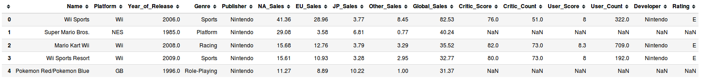
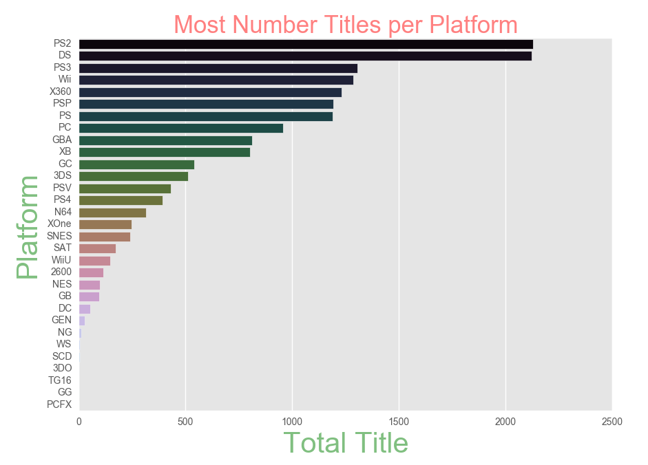
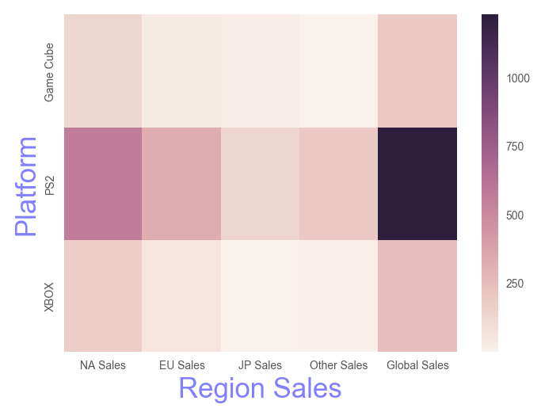

# Gamers don't die, they respawn

This repository is about simple analysis about the game titles, platforms and sales

> Dataset can be downloaded from  [here](https://www.kaggle.com/rush4ratio/video-game-sales-with-ratings)

## Prerequiste
1. Python 3
2. Jupyter Notebook
3. Pandas (for data analysis)
4. Numpy
5. Matplotlib (for visualization)
6. Seaborn (for visualization)

### Data view

---

### Most Number if Titles per Platform

---

###

